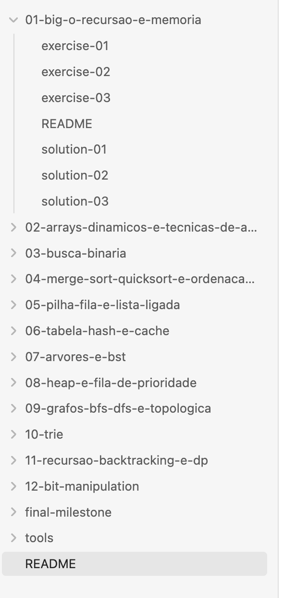

# Jonas Alessi's Skills

Skills created based on interesting topics I found during reading.

## Installation

### Quick install (recommended)

Install this repository into your agent skills directory with the [`skills`](https://www.npmjs.com/package/skills) CLI:

```bash
npx skills add https://github.com/jonasalessi/skills
```

## Skills

### oo-solid-guide

Applies OO and SOLID principles when writing, reviewing, or refactoring code. Triggers on class design, interfaces, domain models, inheritance/composition, and code reviews. Based on *Orientação a Objetos e SOLID para Ninjas* by Mauricio Aniche.

### tailwind-ui-guide

Builds a consistent, accessible Tailwind UI: defines an HSL palette, dark mode pairs, and semantic tokens, then turns them into Tailwind-ready examples. Triggers on theming, component styling, color palettes, dark mode, and layout work.

### building-objective-driven-training

Builds a custom technical training journey from an `objective.md` (target capability) and `sources.md` (trusted references) in the workspace. Manual invocation only; creates the templates and stops if either file is missing. 



### recalibrate-instructions

Audits and rewrites project skills, `AGENTS.md`, and `CLAUDE.md` for frontier models. Removes scaffolding written for weaker models and keeps the rules that encode project facts. Manual invocation only; accepts an optional path to one skill or file, and shows the findings before it changes anything. Based on [Rethinking skills and prompts for GPT-6 Astra](https://developers.openai.com/blog/rethinking-skills-and-prompts-for-gpt-6-astra).

## Workflow

Eight skills that take a GitHub issue to a merged change and a published release. Adapt them to your project before use. See [workflow/README.md](workflow/README.md).
